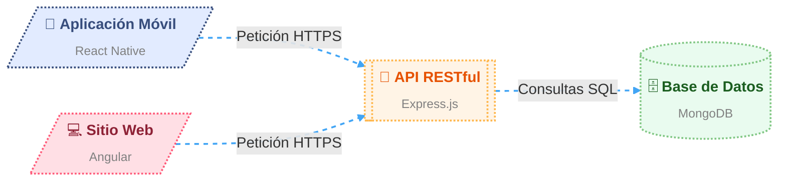

<h1 align="center">
  
  $\color{CadetBlue}{Aplicación\ Móvil\ para}$ $\color{SeaGreen}{Flor\ \&\ Cera}$
  
</h1>

> [!IMPORTANT]
> **Descripción del Trabajo de Integración Curricular**
>
> “Flor & Cera” es un emprendimiento dedicado a la elaboración de productos artesanales con ingredientes naturales y sostenibles,
> que busca innovar y fortalecer su presencia comercial mediante un canal digital que permita a los clientes personalizar y visualizar sus productos de forma autónoma.
> Este proyecto propone el desarrollo de una aplicación móvil para ampliar su alcance y accesibilidad, incorporando un módulo de Inteligencia Artificial
> que ofrezca recomendaciones personalizadas basadas en los gustos y estilo del cliente.

---

### 🧩 Componentes del Proyecto

---
