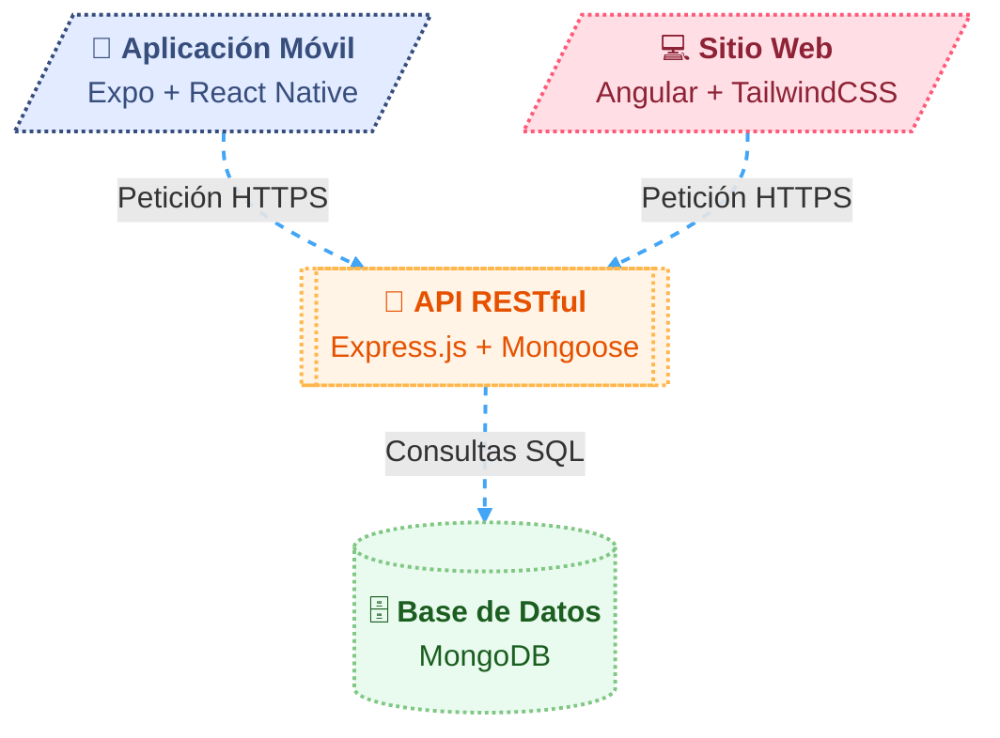

<h1 align="center">
  
  $\color{CadetBlue}{Aplicación\ Móvil\ para}$ $\color{SeaGreen}{Flor\ \&\ Cera}$
  
</h1>

> [!IMPORTANT]
> **Descripción del Trabajo de Integración Curricular**
>
> “Flor & Cera” es un emprendimiento dedicado a la elaboración de productos artesanales con ingredientes naturales y sostenibles,
> que busca innovar y fortalecer su presencia comercial mediante un canal digital que permita a los clientes personalizar y visualizar sus productos de forma autónoma.
> Este proyecto propone el desarrollo de una aplicación móvil para ampliar su alcance y accesibilidad, incorporando un módulo de Inteligencia Artificial
> que ofrezca recomendaciones personalizadas basadas en los gustos y estilo del cliente.

### 💼 Documentos de Respaldo del Trabajo de Integración Curricular

| Documento | Descripción | Enlace |
|-----------|-------------|--------|
| 📄 **TIC Completo** | Documento final del Trabajo de Integración Curricular |  |
| 📝 **Formulario F_AA_233A** | Formulario de aprobación para iniciar el proyecto de TIC |  |
| 🏢 **Certificado de Cumplimiento** | Certificado de cumplimiento de requisitos emitido por Flor & Cera |  |
| 🎥 **Manual de Usuario** | Video completo publicado en YouTube |  |

---

### 🧩 Arquitectura Completa del Sistema

---
