<h1 align="center">
  
  $\color{CadetBlue}{Aplicación\ Móvil\ para}$ $\color{SeaGreen}{Flor\ \&\ Cera}$
  
</h1>

> [!IMPORTANT]
> **Descripción del Trabajo de Integración Curricular**
>
> “Flor & Cera” es un emprendimiento dedicado a la elaboración de productos artesanales con ingredientes naturales y sostenibles,
> que busca innovar y fortalecer su presencia comercial mediante un canal digital que permita a los clientes personalizar y visualizar sus productos de forma autónoma.
> Este proyecto propone el desarrollo de una aplicación móvil para ampliar su alcance y accesibilidad, incorporando un módulo de Inteligencia Artificial
> que ofrezca recomendaciones personalizadas basadas en los gustos y estilo del cliente.

### 💼 Documentos de Respaldo del Trabajo de Integración Curricular

---

### 🧩 Arquitectura Completa del Sistema

```mermaid
flowchart TB
  APP@{ shape: lean-r, label: "📱 **Aplicación Móvil**<br/>Expo + React Native" }
  WEB@{ shape: lean-r, label: "💻 **Sitio Web**<br/>Angular + TailwindCSS" }
  API@{ shape: subproc, label: "🔗 **API RESTful**<br/>Express.js + Mongoose" }
  DB@{ shape: cylinder, label: "🗄️ **Base de Datos**<br/>MongoDB" }

  APP -. Petición HTTPS .-> API
  WEB -. Petición HTTPS .-> API
  API -. Consultas SQL .-> DB

  APP:::application
  WEB:::frontend
  API:::backend
  DB:::database

  classDef application stroke-width:2px,stroke:#374D7C,fill:#E2EBFF,color:#374D7C,stroke-dasharray: 2
  classDef frontend stroke-width:2px,stroke:#FF5978,fill:#FFDFE5,color:#8E2236,stroke-dasharray: 2
  classDef backend fill:#FFF4E6,stroke:#FFB74D,stroke-width:2px,color:#E65100,shadow,stroke-dasharray: 2
  classDef database fill:#E9FBEF,stroke:#81C784,stroke-width:2px,color:#1B5E20,shadow,stroke-dasharray: 2

  linkStyle 0 stroke:#42A5F5,stroke-width:2px,stroke-dasharray: 5 5
  linkStyle 1 stroke:#42A5F5,stroke-width:2px,stroke-dasharray: 5 5
  linkStyle 2 stroke:#42A5F5,stroke-width:2px,stroke-dasharray: 5 5
```

---

